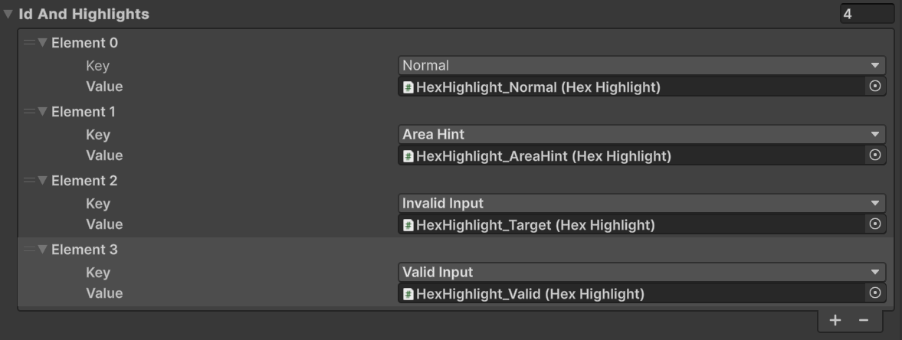

# NonebNi
> Experimental project on a tile based strategy game and custom editor

This is an experiment project primarily created for experiment, where I play with ideas such as manual DI(which I should be able to automate now with _Source Generator_) and custom editor.

There are also automated testings when applicable as a prove of concept(_i.e glorified toy_). Note most of the projects aren't actually working properly so proceeds with cautious.

## Demo - Scene Editing
> Various tools to help spot issues immediately when they are created

Feature:
1. **Settings Window**:  that allow for immediate refresh and swapping level configuration(Level's data is automatically saved in the configuration)
2. **Tile Inspector**: handy tooltips of information about the current highlight tile
3. **Error List**: list of error objects where the "?" button makes navigation quick and intuitive, scrollable when you have too many of errors.
4. **On Scene Error**: shows up whenever the setup in the scene is incorrect, currently fighting with a [bug with Unity](https://issuetracker.unity3d.com/issues/hot-control-changes-when-drawing-a-button-using-guilayout) to make it work properly

## Demo - Command Console
> A flexible tool to manipulate the current game's state

I find command line to be the most flexible way to implement various debug feature(albeit not the most intuitive), so I just created one and see how it goes.
1. Parsing arguments: non primitive type such as coordinate are also supported
2. Output error message whenever necessary

Note: history of previous commands are yet to be implemented.

## Demo - Custom Inspectors
> Validating config as you set up your component

Configuration of potentially complicated components are validated at design time. Simple errors are shown in the inspector to draw designer's attention.

## Demo - Custom Property
> Restricting animator related configuration to avoid typos 

Animator's parameters and layers are often prone to typos - so I created some handy inspector for them to make life easier for everyone

## Demo - Auto Complete Fields
> Search engine shouldn't be the only one auto completing for you

No one wants to type out data reference manually, it's just way too tedious! So I made it simple to draw auto complete fields in the editor.

## Demo - Serializable Dictionary
> Dictionary in UnityEngine.Object isn't editable by default, so I make sure I can at least work around it.

One day Dictionary would be supported by Unity out of the box, for now I use `SerializableDictionary` to side step this limitation.